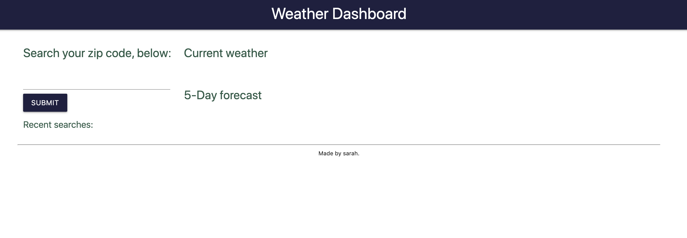
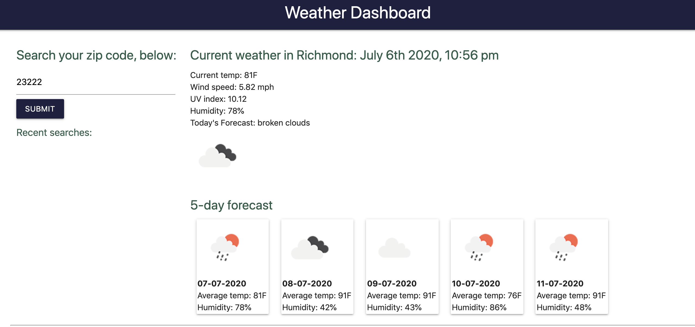
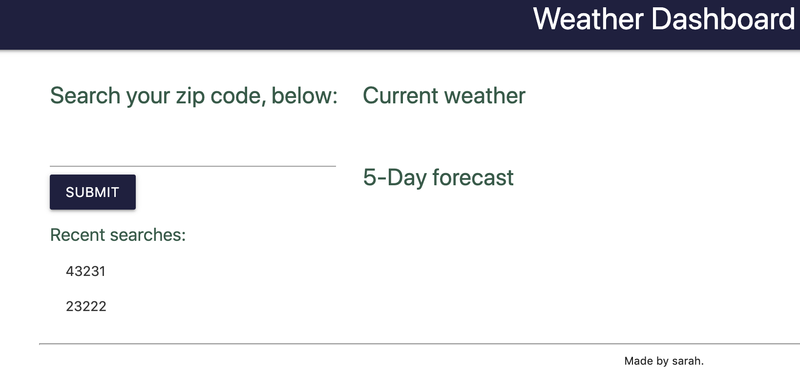

# WeatherDashboard

This application is intended to be a quick, easy interface for searching the weather in a particular city. It's dashboard is relatively simple, offering current weather details and a 5-day snapshot of the weather in the city searched. 

Previously searched cities appear in the sidebar, where users can quickly toggle to cities stored locally. 

# Applicaiton Photos 

Website home screen, with no saved searches: 

City search results: 

Pre-loaded, saved searches: 

# Relevant Links 

GitHub repository: https://github.com/skerr924/WeatherDashboard

Deployed application: https://skerr924.github.io/WeatherDashboard/